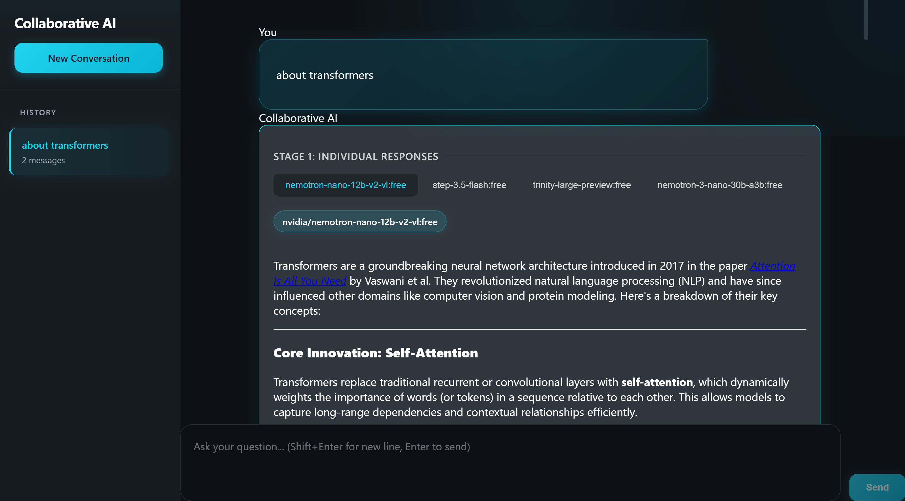
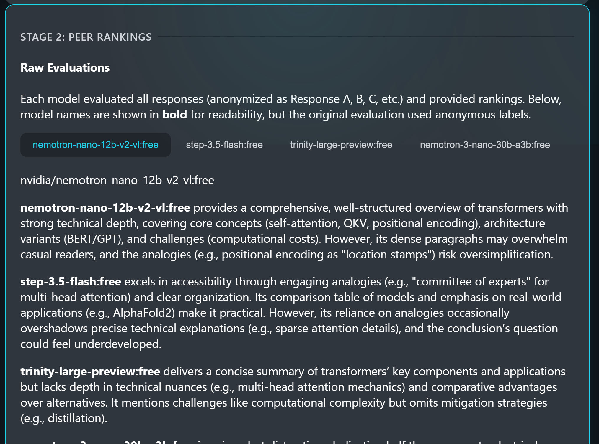
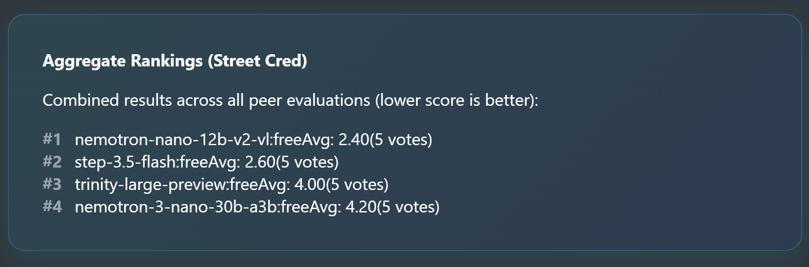
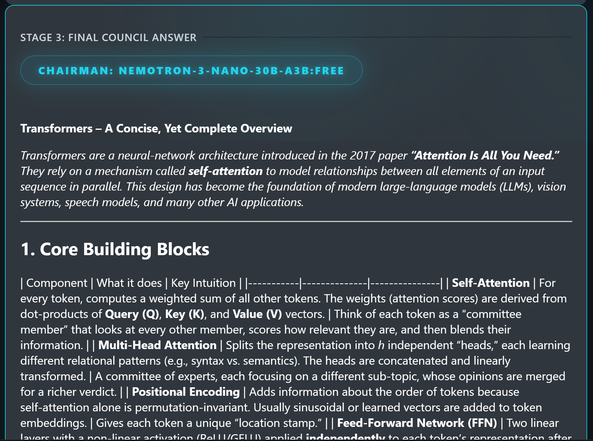

# 🤝 Collaborative AI — LLM Council

> **A multi-model AI deliberation system** — ask a question, let multiple LLMs debate, rank each other's work, and deliver a unified final answer.

Built entirely by **Mahesh Challa** as a personal project to explore how multiple large language models can collaboratively reason, critique, and synthesize better answers than any single model alone.

---

## 💡 What is This?

Instead of relying on a single AI model, **Collaborative AI** routes your query to a **council of LLMs** via [OpenRouter](https://openrouter.ai/). The models independently answer your question, anonymously critique each other's responses, and finally a designated **Chairman LLM** synthesizes everything into one polished final answer.

It's like having a board of AI experts deliberate before giving you a response.

---

## 🔄 How It Works — 3-Stage Pipeline

### Stage 1 — Individual Opinions
Each council model independently answers the user's query in parallel. All responses are shown in a tab view for side-by-side inspection.



---

### Stage 2 — Anonymous Peer Review
Each model receives all other models' responses, **anonymized** (labeled as "Response A", "Response B", etc.) to prevent identity bias. Each model ranks the responses by accuracy and insight.




---

### Stage 3 — Chairman Synthesis
The **Chairman LLM** takes all Stage 1 responses and Stage 2 rankings, then synthesizes a final, consolidated answer presented to the user.



---

## 🧱 Architecture

```
User Query
    ↓
Stage 1: Parallel queries → [individual responses from all council models]
    ↓
Stage 2: Anonymize → Parallel ranking queries → [evaluations + parsed rankings]
    ↓
Aggregate Rankings Calculation → [sorted by average position]
    ↓
Stage 3: Chairman synthesizes with full context
    ↓
Return: { stage1, stage2, stage3, metadata }
    ↓
Frontend: Tab view + ranking UI + validation
```

### Backend (`backend/`)

| File | Purpose |
|------|---------|
| `config.py` | Council model list, Chairman model, API key config |
| `openrouter.py` | Async HTTP client for OpenRouter API |
| `council.py` | Core 3-stage deliberation logic |
| `storage.py` | JSON-based conversation persistence |
| `main.py` | FastAPI app, CORS, REST endpoints |

### Frontend (`frontend/src/`)

| File | Purpose |
|------|---------|
| `App.jsx` | Conversation state management |
| `components/ChatInterface.jsx` | Message input UI |
| `components/Stage1.jsx` | Tab view of individual model responses |
| `components/Stage2.jsx` | Raw peer evaluations + de-anonymized rankings |
| `components/Stage3.jsx` | Final synthesized chairman response |

---

## 🛠️ Setup

### Prerequisites

- Python 3.10+
- Node.js 18+
- [uv](https://docs.astral.sh/uv/) (Python package manager)
- An [OpenRouter](https://openrouter.ai/) account + API key

---

### 1. Clone the Repository

```bash
git clone https://github.com/MaheshChalla2701/collaborative-ai.git
cd collaborative-ai
```

### 2. Install Dependencies

**Backend:**
```bash
uv sync
```

**Frontend:**
```bash
cd frontend
npm install
cd ..
```

### 3. Configure API Key

Create a `.env` file in the project root:

```env
OPENROUTER_API_KEY=sk-or-v1-...
```

Get your API key at [openrouter.ai](https://openrouter.ai/). Make sure to add credits or enable auto top-up.

### 4. Configure the Council (Optional)

Edit `backend/config.py` to customize which models sit on your council and which one is the Chairman:

```python
COUNCIL_MODELS = [
    "amazon/nova-2-lite-free",
    "arcee-ai/trinity-mini-free",
    "deepseek/deepseek-v3.2",
    "mistralai/ministral-3-14b-instruct-2512",
    "x-ai/grok-4.1-fast",
    "nvidia/nemotron-nano-12b-v2-vl:free",
    "openai/gpt-oss-safeguard-20b",
    "qwen/qwen3-vl-30b-a3b-thinking",
    "stepfun/step-3.5-flash:free",
    "arcee-ai/trinity-large-preview:free",
    "nvidia/nemotron-3-nano-30b-a3b:free",
]

CHAIRMAN_MODEL = "nvidia/nemotron-3-nano-30b-a3b:free"
```

You can use any model identifier supported by OpenRouter.

---

## ▶️ Running the App

**Option 1 — Start script (easiest):**
```bash
./start.sh
```

**Option 2 — Manual:**

Terminal 1 (Backend):
```bash
uv run python -m backend.main
```

Terminal 2 (Frontend):
```bash
cd frontend
npm run dev
```

Then open **http://localhost:5173** in your browser.

> **Ports:** Backend runs on `8001`, Frontend on `5173` (Vite default).

---

## 🧰 Tech Stack

| Layer | Technology |
|-------|-----------|
| **Backend** | FastAPI (Python 3.10+), async `httpx`, Pydantic v2 |
| **Frontend** | React + Vite, `react-markdown` |
| **AI Gateway** | OpenRouter API (multi-model routing) |
| **Storage** | JSON files in `data/conversations/` |
| **Package Mgmt** | `uv` (Python), `npm` (JavaScript) |

---

## ✨ Key Design Decisions

- **Anonymized Peer Review** — Models receive each other's responses labeled as "Response A/B/C/..." to prevent identity-based bias in rankings.
- **Graceful Degradation** — If one model fails, the council continues with the remaining successful responses.
- **Full Transparency** — All raw model outputs and extracted rankings are inspectable in the UI for trust and debugging.
- **Ephemeral Metadata** — The label-to-model mapping and aggregate rankings are returned via the API but not persisted to storage (privacy-friendly by design).

---

## 📁 Project Structure

```
collaborative-ai/
├── backend/
│   ├── config.py         # Model config & API keys
│   ├── council.py        # 3-stage deliberation core
│   ├── main.py           # FastAPI app & routes
│   ├── openrouter.py     # Async OpenRouter client
│   └── storage.py        # Conversation persistence
├── frontend/
│   ├── src/
│   │   ├── App.jsx
│   │   ├── api.js
│   │   └── components/
│   │       ├── ChatInterface.jsx
│   │       ├── Stage1.jsx
│   │       ├── Stage2.jsx
│   │       └── Stage3.jsx
│   └── vite.config.js
├── data/
│   └── conversations/    # Stored conversation JSON files
├── .env                  # API key (not committed)
├── pyproject.toml
├── start.sh              # Convenience startup script
└── README.md
```

---

## 👤 Author

**Mahesh Challa**
- GitHub: [@MaheshChalla2701](https://github.com/MaheshChalla2701)

Built from scratch as a personal exploration into multi-agent AI collaboration and anonymous peer review between language models.

---

## 📄 License

This project is open source. Feel free to fork, explore, or extend it however you like.
